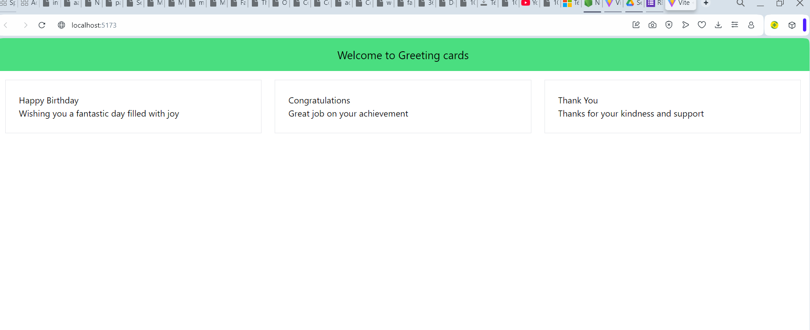

# Greeting Cards  
## --Discussion, Overview
This project is a  React application built using Vite and styled with Tailwind CSS. It allows users to:  
- Display a welcoming header.  
- Create and display multiple greeting cards with unique titles and messages. 

I ##--learnt how to set up###
- Setting up a React project using Vite.  
- Styling components using Tailwind CSS.  
- Creating reusable functional components in React.  
- Passing props to dynamically display content.  

---
## --Testing  

The following screenshot demonstrate the output of the project:   
    

---